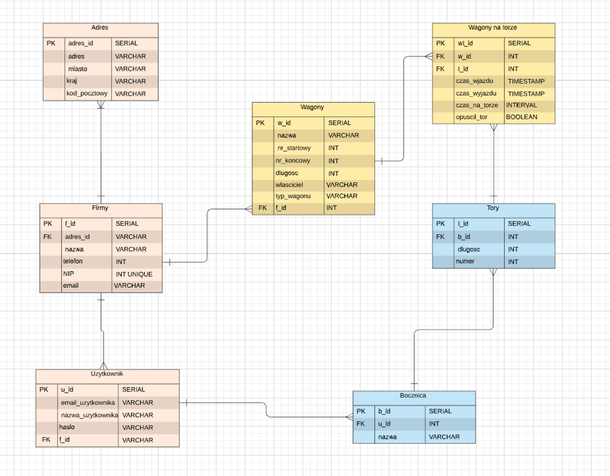
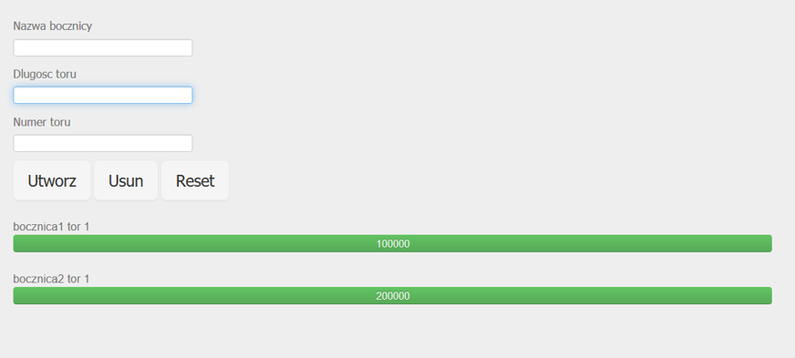
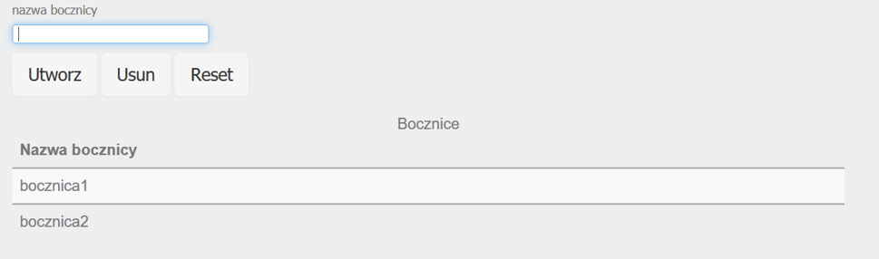
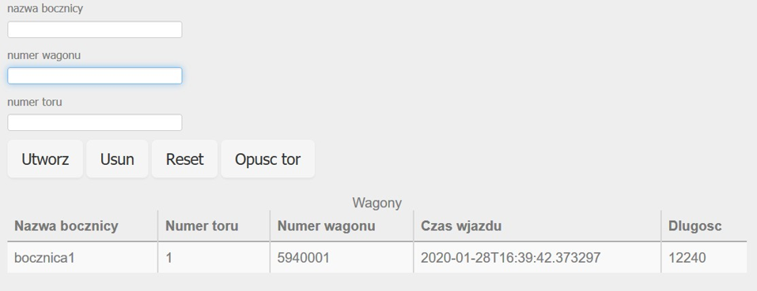
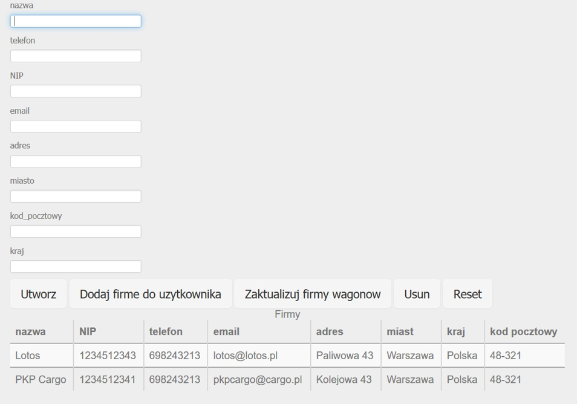
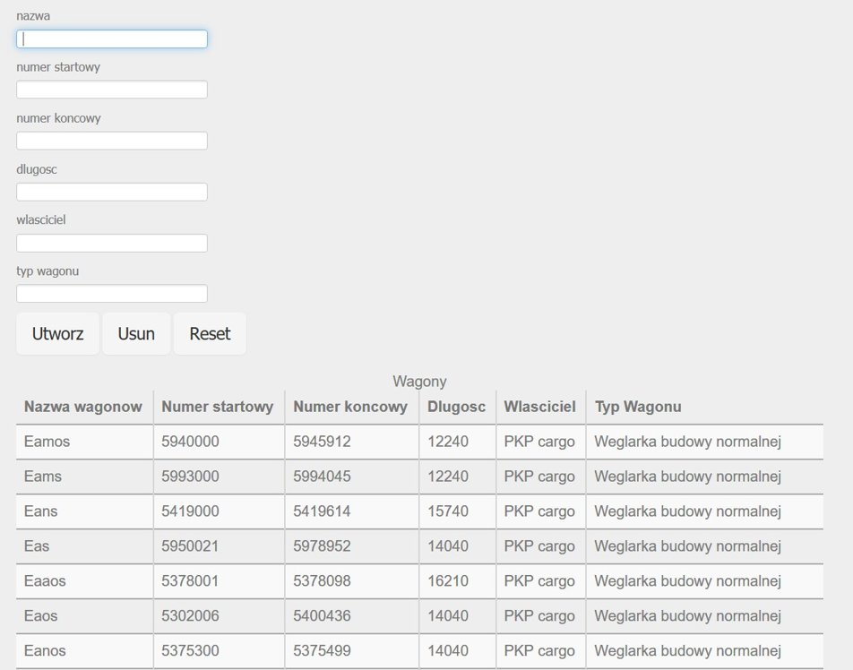
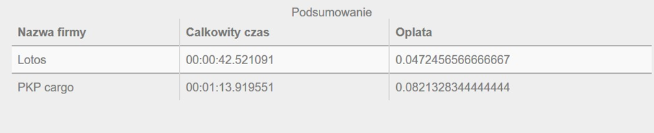

# Project-BD
## Projekt koncepcji, założenia
### Temat projektu
Projekt pt. “Zarządzanie Bocznicą” przeznaczony jest do obsługi bocznicy użytkownika.
Jego celem jest możliwość wprowadzania nowych bocznic, torów na bocznicach oraz
wprowadzanie wagonów wjeżdżających i wyjeżdżających z bocznicy. Dodatkową 
funkcjonalnością jest obliczanie zajętości toru, czyli jak dużo wolnego toru
zostało dla wagonów oraz wyliczanie podsumowania jak długo wagony danej firmy
przebywały na bocznicach użytkownika i ile dana firma musi zapłacić po 
uwzględnieniu określonej stawki za przebywanie na torze.

### Analiza wymagań użytkownika
Dla użytkownika zarządzania bocznicą konieczne są z pewnością następujące funkcjonalności:
*	Przegląd swoich bocznic, torów, wagonów na torze oraz możliwość dostępu do tabeli wagonów
  bazowych która zawiera informacje ogólne o wagonach dla jakiegoś przedziału numerów wagonów.
  Oraz dostęp do list firm
*	Informacje o torach użytkownika, ile jeszcze zostało nam toru do wykorzystania
*	możliwość podsumowania czasu wagonów na torze

### Zaprojektowanie funkcji
Podstawowe	funkcje	programu	są realizowane zgodnie z powyższymi wymogami użytkownika i są
podzielone funkcjonalnie na trzy połączone ze sobą działy:
*	Wprowadzanie i przegląd swoich bocznic, torów, oraz wagonów na torze, możliwość dodania danych firmy do użytkownika oraz do wagonów
*	Informacja o torach zwracająca zajętość toru
*	Podsumowanie czasu wagonów na torze wykorzystując id użytkownika

## Projekt diagramów
Diagram ERD przedstawiony jest na poniższej ilustracji (rys.1) i pokazuje wszystkie encje
programu wraz z realizacją połączeń między nimi oraz zawartymi w encjach kluczami.

##Projekt logiczny
###Projekt bazy
Projekt bazy w języku wraz z podstawową zawartością podlinkowany został w panelu głównym aplikacji.
###Funkcje w Bazie Danych
Operacje na danych realizowane są zarówno za pomocą bezpośrednich wywołań zapytań SQL w kodzie python, jak i korzystając 
z wstępnie zdefiniowanych funkcji. Plik z funkcjami realizowanymi po stronie serwera bazy danych podlinkowany został na 
głównym panelu aplikacji.
##Projekt funkcjonalny
###Prezentacja i edycja danych
Prezentacja danych jest realizowana za pomocą tabel wyświetlanych na żądanie użytkownika aplikacji oraz dla torów jest to 
progress bar, który pokazuje zajętość toru. Formularze do wprowadzania danych dotyczą wszystkich tabel zdefiniowanych w projekcie
i korzystają z tagów HTML: <form>. Typy wejść są zależne od typu wprowadzanych danych, a serwer oraz przeglądarka przewidują
obsługę pewnych błędów przesyłanych przez użytkownika danych.
###Raporty
W projekcie przewidziano różne rodzaje raportów - począwszy od zwykłych tabelek opartych na relacjach czy perspektywach, 
po zaawansowane analizy wprowadzanych danych, przedstawione jako kompletny zestaw informacji obliczonych przez system.
##Dokumentacja
###Wprowadzanie danych
Bazowe dane zostały wprowadzone do systemu za pomocą poleceń SQL wraz z wykreowaniem tabel i dostępne są w pliku baza.sql na 
stronie głównej aplikacji. Za wprowadzenie reszty danych odpowiada użytkownik.
###Instrukcja obsługi aplikacji
Sposób w jaki powinniśmy obsługiwać aplikację:
1.	Logujemy się lub rejestrujemy
2.	Jeżeli nie mamy żadnych bocznic dodajemy bocznice
3.	Jeżeli mamy bocznice dodajemy tory do naszej bocznicy
4.	Dodajemy wagony do określonej bocznicy i toru, numer wagonu musi mieć 7 cyfr oraz zawierać się między przedziałami dostępnymi 
w zakładce wagony bazowe między numerem startowym a końcowym dowolnego wagonu.
5.	Możemy opuścić tor a następie sprawdzić w tabelce podsumowanie jak długo wszystkie wagony danej firmy przebywały na naszych torach
6.	(Klikając dwa razy na jakiś rekord tabeli powinno uzupełnić nasz formularz tymi danymi)

Aplikacja	posiada	na	głównej	stronie	sześć	zakładek	odpowiadających	różnym funkcjonalnością.
1. Zajętość toru. Pod tą opcją kryje się możliwość dodania torów do już istniejących bocznic. Po dodaniu toru wyświetla
nam się progress bar pokazujący jak dużo toru mamy wolnego (wyświetlane dane są w milimetrach, ponieważ długość wagonów 
w bazach PKP także jest w milimetrach). Nad każdym progress barem widnieje nazwa bocznicy oraz numer toru.

2. Podgląd bocznic wyświetla w tabeli wszystkie bocznice, które dodał użytkownik oraz
pozwala na dodanie nowej bocznicy lub jej usunięcie.

3. Wagony. Pozwala na dodanie wagonu na tor lub opuszczeniu wagonu z toru o numerze który znajduje się w przedziale 
numerów w zdefiniowanej wcześniej tabeli wagony. Przedział tych numerów jest z góry zdefiniowany przykładowe dane zostały
pobrane ze strony PKP cargo. Wprowadzając numer wagonu baza wyszukuje podany numer wagonu w tablicy wagony i dodaje w_id 
do rekordu wagony_na_torze z którego zostają pobrane informacje np. o długości wagonu. Przy tworzeniu wagonu do pola 
czas_wjazdu zostaje przypisana aktualny znacznik czasowy natomiast po naciśnięciu opuść tor do czas_wyjazdu przypisywany 
jest aktualny znacznik czasowy i obliczany czas jaki wagon był na torze, rekord znika z tabeli, ponieważ do pola opuscil_tor 
przypisywana jest wartość TRUE.

4.	Dodaj firme. Umożliwia dodanie nowych firm wraz z adresem oraz przypisanie ich ID do użytkownika lub przypisaniu firm 
do wagonów bazowych jeśli nazwa firmy pokrywa się z nazwą firmy w tabeli wagony. Funkcjonalność ta może być potrzebna przy
rozwijaniu aplikacji jeśli na przykład będą generowane faktury

5. Wyswietl wagony bazowe. Pozwala na wyswietlenie calej tabeli wagonow bazowych która zawiera wszystkie przedzialy numerow wagonow,
 które możemy wprowadzać do wagonów na torze

6. Podsumowanie oblicza jaki czas wszystkie wagony danej firmy spędziły na torach użytkownika i oblicza ile dana firma musi zapłacić.

